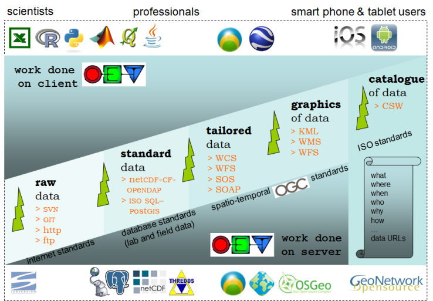
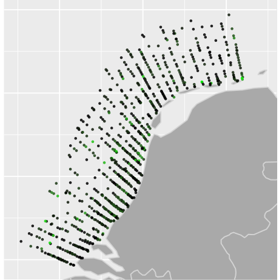

```{r load_packages, include=FALSE}
require(RPostgreSQL)
require(sp)
require(leaflet)
require(ggplot2)
require(rworldmap)
require(httr)
```

## Overview

* OpenEarth
* Ecological monitoring Marine Projects
* Interactive data exploration
* Transparant and reproducible data products

## OpenEarth data management

* Data, Models, Tools
* Generic workflow and conventions
    + Version control of data and tools
    + Traceable and reproducible
    + Use available open technical and semantic standards
    + Open Source software

##



##


##Ecological monitoring Marine Projects

<div class="columns-2">
  

* Ecological monitoring
    + Licencing process e.g. wind parks
    + diverse data
    + make data available
    + for multiple use
    + all use same version

</div>


# Interactive documents

## Rshiny - interactivity

* Model as a service
* Web application
    + [North Sea Waterbase data](http://tl-284.xtr.deltares.nl:3838/deltares/Noordzee/) (at Deltares test server, only from within Deltares intranet)
    + [same at Rstudio Shinyapps service](https://gammarus.shinyapps.io/ShinyWaterbaseNoordzee)
* Html document
    + [ShWoZ Bird heatmaps](https://gammarus.shinyapps.io/Interactive_gridding/)
    
## Rshiny - how to go about

* UI and Server script (named UI.r and Server.r)
    + File/New Project../  new folder / Shiny web application
* Use app from within Rstudio
    + Rstudio contains ShinyServer
* Deploy app via Rstudio [Shinyapps](http://www.shinyapps.io/)
* Deploy app via locally installed [ShinyServer](http://tl-284.xtr.deltares.nl:3838/)

# Reproducible reporting

## Principle

* Transparent work flow
* From data source to final product
* Optimal when    
    + Centralized source data
    + Version controlled scripts
    + Keep scripts and report together
        + Rmarkdown (R, basic Python, more)
        + [Jupyter](https://www.continuum.io/blog/developer/jupyter-and-conda-r?mc_cid=c91ccee4a5&mc_eid=3a45b30e21) (Python, R, Matlab, more) or [here](https://irkernel.github.io/installation/)
        
## Rmarkdown

* A Markdown-formatted document should be publishable as-is, as plain text, without looking like it’s been marked up with tags or formatting instructions. – John Gruber
* comes as R package (runs from every IDE or from console)
* R code + text/MD/html --> markdown (MD) --> pdf, html, word
* html can be combined with interactivity (Shiny)

## What does Rmarkdown do?

<div class="columns-2">

Code chunks

\```{r}  
plot(cars)  
\``` 

```{r, echo = F, fig.height=5, fig.width=3}
plot(cars)
```

</div>

## Also works with Python

\```{python}  
x = 1  
if x == 1:  
    # indented four spaces  
    print "x is 1."  
\```  

generates:
```{python}
x = 1
if x == 1:
    # indented four spaces
    print "x is 1."
```

But graphics are apparently not (yet) supported.. 

## In-line code in markdown document

Or run inline code to calculate that the average speed = `r mean(cars$speed)` .

in Rmarkdown:

Or run inline code to calculate that the average speed = \`r_ mean(cars$speed) \` .

## Styling and formatting of Rmarkdown reports

* [R markdown](http://rmarkdown.rstudio.com/)

* [Cheatsheets](http://www.rstudio.com/wp-content/uploads/2015/02/rmarkdown-cheatsheet.pdf)

* use css (Custom Style Sheet)


## Accessing data 

* Connecting to a database
* Connecting to a service (WFS)


## Gridded data products

* Heat maps
* Data interpolation
* Export to NetCDF file format

## Practical

* Start Rshiny document
* Start Rmarkdown document
* Use open data set


## Connect to WFS
Read GeoJSON WFS and plot in leaflet map
The data that are used here are pelagic fish data from the MEP-NSW ecological monitoring. 
Look at the url: only the first 50 records are read here. 
```{r, eval=FALSE}
url <- "http://marineprojects.openearth.nl/geoserver/mep-nsw/ows?service=WFS&version=1.0.0&request=GetFeature&typeName=mep-nsw:mep-nsw_pvis&maxFeatures=50&outputFormat=json"

```


## Connect to WFS
```{r, eval=FALSE, tidy = T, .smaller}
jsonResult <- GET(url)
leaflet() %>%
  setView(lat = 52.5, lng = 4.5, zoom = 9) %>%
  addTiles(group = "OSM (default)") %>% 
  addGeoJSON(content(jsonResult), layerId = "Monster.identificatie")
```


## Data can be plotted on a map using package "ggplot2"" 


## Interactive map using leaflet package


## Extra material


* Possibility to convert R markdown into [slidify](http://slidify.github.io/dcmeetup/#8) presentations

