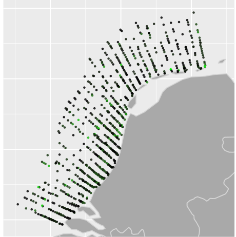

```{r load_packages, include=FALSE}
# require(RPostgreSQL)
# require(sp)
require(leaflet)
# require(ggplot2)
# require(rworldmap)
require(httr)
```

## Overview

* OpenEarth
* Ecological monitoring Marine Projects
* Interactive data exploration
* Transparant and reproducible data products

## OpenEarth data management

* Data, Models, Tools
* Generic workflow and conventions
    + Version control of data and tools
    + Traceable and reproducible
    + Use available open technical and semantic standards
    + Open Source software

##


##


##Ecological monitoring Marine Projects

<div class="columns-2">

* Ecological monitoring data
    + Licencing process e.g. wind parks
    + diverse data
    + [make data available](http://marineprojects.openearth.nl/)
    + for multiple use
    + all use same version



</div>

# Interactive documents

## Rshiny - interactivity

* Model as a service
* Web application
+ [North Sea Waterbase data](http://tl-284.xtr.deltares.nl:3838/deltares/Noordzee/) (at Deltares test server, only from within Deltares intranet)
    + [same at Rstudio Shinyapps service](https://gammarus.shinyapps.io/ShinyWaterbaseNoordzee)
* Html document
    + [ShWoZ Bird heatmaps](https://gammarus.shinyapps.io/Interactive_gridding/)

## Rshiny - how to go about

* Design and code
* UI and Server script (named UI.r and Server.r)
    + can be combined in one script.
    + RStudio: File/New Project../  new folder / Shiny web application
* Run app
* Within Rstudio (contains ShinyServer)
* Deploy app via Rstudio [Shinyapps](http://www.shinyapps.io/)
* Deploy app via locally installed [ShinyServer](http://tl-284.xtr.deltares.nl:3838/)
    - consult ICT-OS 

# Reproducible reporting

## Why reproducible reporting?

* Transparent work flow
* From data source to final product
* Optimal when    
    + Centralized source data
    + Version controlled scripts
    + Keep scripts and report together
    + Rmarkdown (R, basic Python, more)
    + [Jupyter](https://www.continuum.io/blog/developer/jupyter-and-conda-r?mc_cid=c91ccee4a5&mc_eid=3a45b30e21) (Python, R, Matlab, more) or [here](https://irkernel.github.io/installation/)
    + Example - [Veerse meer reports](https://publicwiki.deltares.nl/pages/viewpage.action?pageId=119049204)

## Rmarkdown

* A Markdown-formatted document should be publishable as-is, as plain text, without looking like it’s been marked up with tags or formatting instructions. – John Gruber
* comes as R package (runs from every IDE or from console)
* R code + text/MD/html --> markdown (MD) --> pdf, html, word
* html can be combined with interactivity (Shiny)

## What does Rmarkdown do?

<div class="columns-2">

Code chunks look like this:

\```{r}  
plot(cars)  
\``` 

```{r, echo = F, fig.height=5, fig.width=3}
plot(cars)
```

</div>

## Also works with Python

\```{python}  
x = 1  
if x == 1:  
# indented four spaces  
    print "x is 1."  
\```  

generates:
```{python}
x = 1
if x == 1:
# indented four spaces
    print "x is 1."
```

But graphics are apparently not (yet) supported.. 

## In-line code in markdown document

Or run inline code to calculate that the average speed = `r mean(cars$speed)` .

in Rmarkdown:

Or run inline code to calculate that the average speed = \`r_ mean(cars$speed) \` .

## Styling and formatting of Rmarkdown reports

* [R markdown](http://rmarkdown.rstudio.com/)

* [Cheatsheets](http://www.rstudio.com/wp-content/uploads/2015/02/rmarkdown-cheatsheet.pdf)

* use css (Custom Style Sheet)

## Accessing data 

* Connecting to a database
* Connecting to a service (WFS)


## Access from open database

```{r ConnectDB, message=F, warning=F, results=F}
require(RPostgreSQL)
## loads the PostgreSQL driver
drv <- dbDriver("PostgreSQL")

## Open a connection
# con <- dbConnect(drv, dbname="ICES", host="postgresx03.infra.xtr.deltares.nl", user="dbices", password="vectors")
con <- dbConnect(drv, dbname="ices", host="al-pg010.xtr.deltares.nl", user="geoserver", password="geoserver@D3lt@r3s")

dbListTables(con)
dbListFields(con, "oceanography")
dbListFields(con, "parameter")
partable <- dbReadTable(con, "parameter")
partable

```

## Send Query to the database, and collect data in dataframe

```{r SendQuery, message=F, warning=F, results=F}
res <- dbSendQuery(con, "select 
                  ST_Y(geom) AS latitude, 
                  ST_X(geom) as longitude,
                  datetime as datetime,
                  parameterid as parameterid,
                  pressure as pressure,
                  value as value
                   from 
                  oceanography
                   WHERE
                  geom && ST_MakeEnvelope(5, 50, 8, 55, 4326)
                  AND
                  parameterid = 22")

## fetch all elements from the resultSet into a data.frame
df <- fetch(res, n = -1)
## Closes the connection
dbDisconnect(con)
## Frees all the resources on the driver
dbUnloadDriver(drv)

```

## Map of nitrate concentrations

The below figure shows average winter nitrate for each unique location

```{r DrawMap, message=F, warning=F, results=F}

df2 <- subset(df, df$datetime > "2000-01-01 00:00" & df$pressure < 20)
require(plyr)
df2$parameterid <- mapvalues(df2$parameterid, partable$parameterid, partable$parametercode)
require(reshape2)
averages <- dcast(df2, latitude + longitude + pressure  ~ parameterid, mean)
#make color scale for leaflet map
factpal <- colorNumeric(heat.colors(100), averages[4])

## make leaflet map
leaflet() %>%
  addTiles(group = "OSM (default)") %>%
  addProviderTiles("Hydda.Base", group = "Hydda Base") %>%
  addProviderTiles("Stamen.TonerLite", group = "Toner Lite") %>%
  addCircleMarkers(data=averages, lng = averages$longitude, lat = averages$latitude,
                   popup = sprintf(as.character(paste("pressure:", averages$pressure, ":", colnames(averages)[4]," = ", averages$NTRA))), 
                   radius = 5,
                   color = ~factpal(averages[4]),
                   stroke = F, 
                   fillOpacity = 0.7)  %>%
  addLayersControl(
    baseGroups = c("OSM (default)", "Hydda Base", "Toner Lite"),
    options = layersControlOptions(collapsed = FALSE))
```


## WFS
[Marine projects geoserver](http://marineprojects.openearth.nl/geoserver/web/)
[WTF is WFS en how to?](https://publicwiki.deltares.nl/display/OET/WFS+primer)
First look what is in the wfs (can also interactively be done in QGIS)
using rgdal, building on [GDAL](http://www.gdal.org/)
```{r, warning=F, message=F, results=F}

library(gdalUtils)
library(rgdal)
dsn <- "http://marineprojects.openearth.nl/geoserver/ows?service=WFS&request=GetCapabilities"
ogrinfo(dsn, so=TRUE)
```

## Connect to WFS (format as csv)
Read csv as WFS and plot in leaflet map
The data that are used here are pelagic fish data from the MEP-NSW ecological monitoring. 
Look at the url: only the first 50 records are read here. 
```{r, .smaller}
url2 <- "http://marineprojects.openearth.nl/geoserver/mep-nsw/ows?service=WFS&version=1.0.0&request=GetFeature&typeName=mep-nsw:mep-nsw_pvis&maxFeatures=50&outputFormat=csv"
pvis <- read.csv(url2, stringsAsFactors = F)
pvisloc <- pvis[!duplicated(pvis$Metingomschrijving),] # unique locations
leaflet(data = pvisloc) %>%
  addTiles() %>% 
  addCircleMarkers(~GeometriePunt.x, ~GeometriePunt.y,
             popup = ~as.character(Metingomschrijving)
             # ,
             # clusterOptions = markerClusterOptions()
             ) %>%
  addPopups(data = pvisloc[pvisloc$Metingomschrijving=="nsw",], ~GeometriePunt.x, ~GeometriePunt.y,~as.character(Metingomschrijving))
```

## Gridded data products

* Heat maps
* Data interpolation
* Export to NetCDF file format

## Practical 

* Start Rshiny document
* Start Rmarkdown document
* Use open data set


